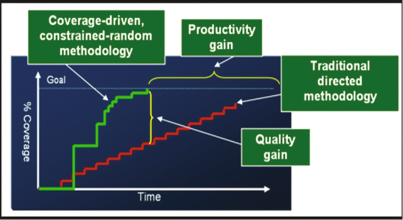

# Aprendizado do Uso de Ferramentas UVM

## Estrutura Típica de UVM
Geralmente, sistemas de teste hardware típico contém os seguintes agentes:

- Interface: Intermediario entre DUT e gerador de sinal (Produtor Consumidor) de maneira sincronizada
- Sequencer: Gerador de Dados (geralmente aleatório) alimentar o driver.
- Drivers: Tem como intuito transferir e sincronizar os dados entre _sequencer_ e Interface. 
- Monitor : Tem como objetivo "monitorar" as entradas e saídas, que são originadas da interface.
- Scoreboard: Pontuação entre esperado(vindo do Driver, que contém um agente para isso) e a saída esperada, vinda do monitor.


Esta é uma estrutura frequentemente utilizada para a verificação de circuitos, onde podemos incluir restrições(constraints), visando uma cobertura eficiente das limitações dos nossos circuitos.

## 1. Como funciona a Verificação:
Os testbench's têm o proposito de avaliar a corretude lógica do seu sistema desenvolvido. Seu funcionamento, para este tipo de arquitetura é

## 2. Cobertura de testes:

Suponha que tenhamos um módulo com duas entradas (`a_in` e `b_in`) de 32 bits de comprimento e saída `y_out`. Supondo-se que temos uma caixa-preta, sem o conhecimento interno, teremos que comparar cada uma das entradas a fim de saber seu correto comportamento. Isso inevitavelmente resulta em uma tabela-verdade com cerca de  2^64 linhas, o que pode ser massivamente custoso e demorado. Então, para isso, temos abordagens menos ingênuas de testes para avaliação do funcionamento de um modelo em hardware.

Dentre os modelos mais comuns, temos os **Testes direcionados** e **Testes Aleatórios**

### a. Testes direcionados: 
Em testes direcionados, selecionamos um conjunto específico de vetores de entrada para exercitar funcionalidades do circuito. Essa abordagem é baseada no conhecimento prévio do funcionamento do design, permitindo criar casos de teste que visam cobrir situações limites ou casos de uso relevantes. Por exemplo, podemos testar valores mínimos e máximos, padrões alternados de bits, ou transições específicas que possam revelar falhas sutis.

A principal vantagem dos testes direcionados é a eficiência: ao focar em situações de interesse, conseguimos detectar rapidamente erros comuns ou problemas conhecidos, sem a necessidade de explorar todo o espaço de entrada.

Exemplos típicos de vetores direcionados incluem:
- Todos os bits em zero (`0x00000000`)
- Todos os bits em um (`0xFFFFFFFF`)
- Padrões alternados (`0xAAAAAAAA`, `0x55555555`)
- Valores de fronteira (mínimo, máximo, meio)
- Padrões de deslocamento (bit único em 1 ou 0 se movendo pela palavra)

Esses testes são especialmente úteis para validar rapidamente o comportamento básico do circuito antes de partir para abordagens mais abrangentes, como os testes aleatórios.

```py
def max(n_bits: int):
    return (1 << n_bits) - 1
```

```py
# Retorna 0b010101... ou 0b10101010..
def alternating(n_bits: int, is_zero: bool):    
    pattern = 0
    for i in range(n_bits):
        bit = (i + is_zero) & 1
        pattern |= (bit << i)
    return pattern
```

### b. Teste Aleatórios: 

No contexto de **Coverage Test**, desenvolvemos um ambiente de verificação que define critérios e métricas para avaliar o quanto os testes exercitam o módulo em análise. A partir desses critérios, geramos entradas aleatórias ou direcionadas, monitorando quais funcionalidades, condições ou combinações de sinais já foram cobertas durante a simulação. O objetivo é maximizar a cobertura funcional, identificando regiões do design que ainda não foram exercitadas pelos testes. Dessa forma, aumentamos a probabilidade de encontrar falhas ou comportamentos inesperados, tornando o processo de verificação mais eficiente. Com isso, cabe ressaltar que este exercício visa complementar áreas possivelmente não exploradas pela cobertura de um teste direcionado. Além disso, o tempo aplicado para um teste randomizado pode, muitas vezes, ser custoso de início. Porém, o espaço de cobertura se torna maior ao longo do desenvolvimento.





# Primeiros Testes com CocoTB
Visando o uso de uma ferramenta open-source, utilizarei a ferramenta 
[CoCoTB](#referencias) para o desenvolvimento dos módulos e ensaios neste repositório.
Para a montagem dos modelos apresentados, usaremos verilog-2001.

### 1. Como funciona a Ferramenta:

### 2. Módulos interessantes:
#### Cocotb Drivers 
A ferramenta CoCoTB oferece barramentos de Drivers que de certa forma comuns, nos quais oferem algumas funcionalidades interessantes para o uso em testbenches. Com base no tipo de transação que desejamos, o CoCoTB gerencia uma co-rotina que visa serializar as transações que escolhemos enviar para o nosso módulo desejado. Assim, é importante elencar dois 


BusDriver: nos fornece uma fila que inserimos dados e sinais sincronizados. Em seguida temos um metodo que insere os dados no modulo Driver.
Podemos separar Drivers como entrada/saída, que permite dar clareza na separação dos sinais de entrada e saída. Este intuito é para acoplar drivers que correspondem ao sequecer e ao scoreboard, respectivamente.


# Referencias

[1].[CocoTB Framework](https://www.cocotb.org/)
